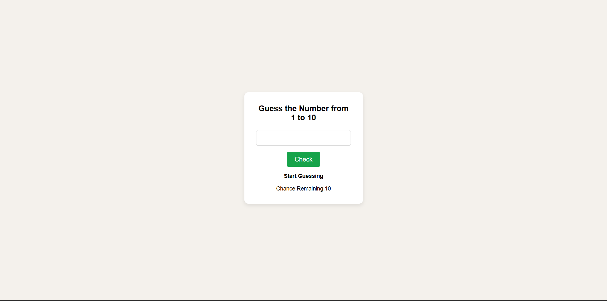
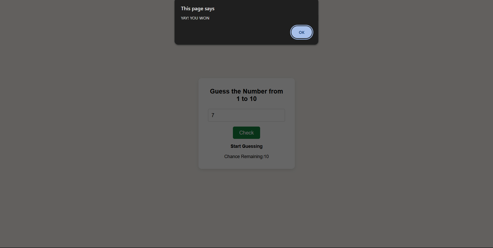
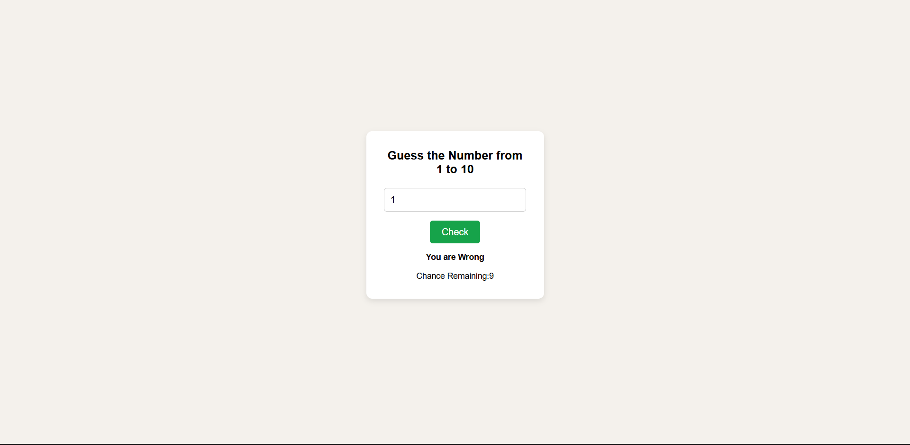

# Guess the Number – JavaScript Practice Project

Guess the Number is a simple interactive game built using **HTML, CSS, and JavaScript** as part of frontend practice.  
The main goal of this project is to practice **JavaScript logic**, conditional statements, and DOM manipulation.


## 🎯 Project Objective

> This project helped strengthen my understanding of JavaScript fundamentals through a fun guessing game.

- Practice **JavaScript conditional logic**
- Work with **random number generation**
- Manipulate the **DOM dynamically**
- Track user chances
- Improve confidence in basic JavaScript projects


## 🛠️ Technologies Used

- HTML5  
- CSS3  
- JavaScript (Vanilla JS)


## 📁 Project Structure

guess-the-number-js/
│
├── index.html
├── style.css
└── script.js


## ✨ Features

- Random number generated between 1 and 10
- User input for guessing the number
- Displays result as right or wrong
- Tracks remaining chances
- Simple and clean UI


## 📘 Learning Outcomes

- Improved understanding of JavaScript conditions
- Learned how to interact with the DOM
- Gained experience handling user input and game logic


## 🚀 How to Run the Project

1. Clone the repository
   ```bash
   git clone https://github.com/dinishsg/guess-the-number-js.git
2. Open index.html in any web browser.


## 📸 Screenshots 

 




## 🌐 Live Demo 

🔗(https://dinishsg.github.io/guess-the-number-js/)
